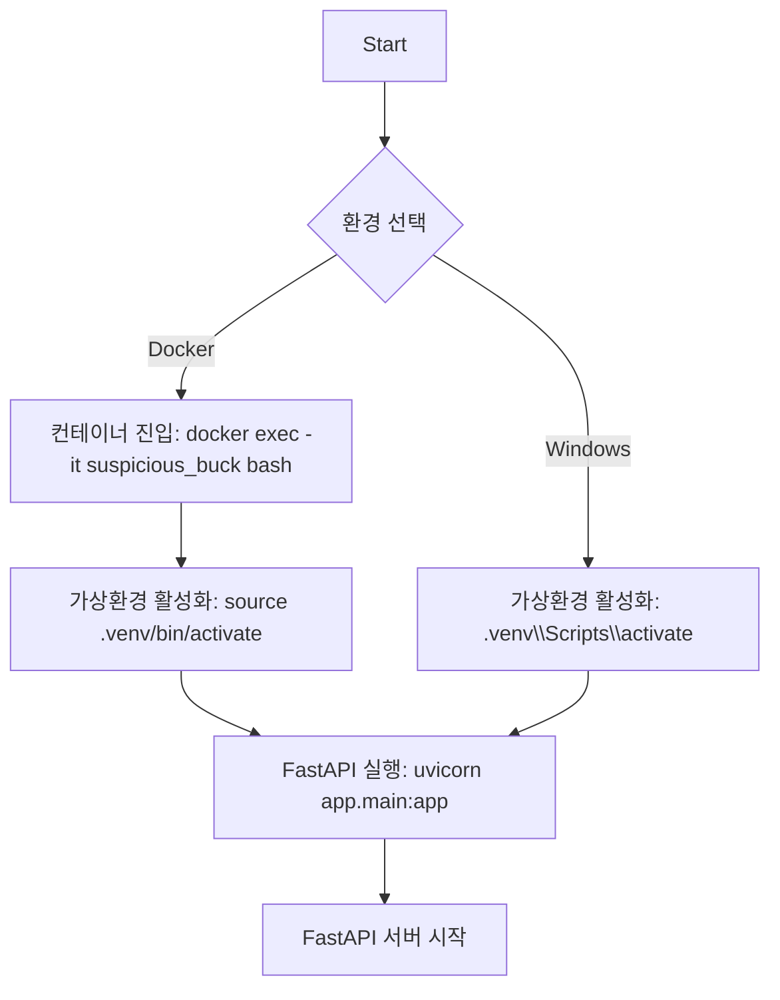

# Battlefield-object-recognition-learning-model
전장 사물 인식 학습 모델 구현 프로젝트 - 전차의 이미지 기반 표적 자동 조준 시스템 개발

## 깃허브 연결 명령어
터미널에서 아래 명령어를 입력합니다.
<pre><code>git clone https://github.com/Rotem-Third-Project/Battlefield-object-recognition-learning-model.git
cd Battlefield-object-recognition-learning-model
code . --reuse-window
</code></pre>

## 📂 루트 디렉토리 및 주요 파일 구조
<!-- STRUCTURE-START -->
```
📁 루트 폴더
├── .devcontainer/   # Dev Container 개발 환경 설정 파일
├── app/   # 메인 애플리케이션 코드
├── data/   # 이미지 등 샘플 데이터 저장
└── test/   # 테스트 코드 모음

📄 루트 파일
├── .gitignore   # Git이 추적하지 않아야 할 파일 및 디렉토리를 정의
├── README.md   # 프로젝트 소개 및 사용법 문서
├── package-lock.json   # 의존성 버전을 고정하는 자동 생성 파일
├── package.json   # Node.js 프로젝트 설정 및 의존성 정의 파일
├── requirements.txt   # Python 의존성 정의 파일
└── 요구사항정의서.md 
```
<!-- STRUCTURE-END -->

---

## 🧠 Linear 자동 이슈 & 프로젝트 생성 규칙
<!-- ISSUE-AUTO-GUIDE-START -->

### 📌 커밋 메시지 기반 이슈 처리

커밋 메시지에 `HYU` 키워드를 포함하면 Linear에 자동으로 이슈가 생성됩니다.  
위치는 **맨 앞** 또는 **맨 뒤**에 위치할 수 있으며, 둘 다 있을 경우 **맨 앞이 우선 처리**됩니다.

| 형식              | 동작 설명                        | 대상            | 예시 커밋 메시지                |
|------------------|----------------------------------|------------------|---------------------------------|
| `HYU 메시지`     | 일반 이슈 생성                   | 프로젝트         | `HYU 이미지 수집 전략 개선`     |
| `HYU-12 메시지`  | 서브이슈 생성 (상위 이슈 하위)   | HYU-12 이슈      | `HYU-12 데이터 정제 추가`       |
| `HYU-12-m 메시지`| 댓글 추가 (상위 이슈에 메모)     | HYU-12 이슈      | `HYU-12-m 모델 결과 확인 필요`  |

✅ 맨 뒤에 붙여도 작동합니다:  
`이미지 수집 전략 개선 HYU`, `전처리 개선 HYU-12`, `모델 테스트 완료 HYU-12-m`

---

### 🧱 프로젝트 연결 기준

| 브랜치 이름 | 연결될 Linear 프로젝트 이름                     |
|-------------|---------------------------------------------------|
| `main`      | `Battlefield-object-recognition-learning-model` |
| 기타 브랜치 | 브랜치명과 동일한 이름의 프로젝트 (예: `ToDo`) |

- **프로젝트가 존재하지 않을 경우:** 작업 중단됨 (에러 출력)
- `main` 브랜치는 항상 지정된 고정 프로젝트와 연결됨

---

### 🛠 브랜치 생성 시 자동 프로젝트 생성

브랜치를 새로 생성하면,  
**브랜치명과 동일한 이름의 Linear 프로젝트가 자동으로 생성**됩니다.  
(단, `main`은 예외이며 자동 생성되지 않음)

| 브랜치 | 생성될 프로젝트 | 상태       |
|--------|------------------|------------|
| `ToDo` | `ToDo`           | In Progress |
| `refactor` | `refactor`     | In Progress |

---

### 🏷️ 자동 설정되는 상태와 라벨

| 유형         | 상태 (`In Progress`) | 라벨         |
|--------------|----------------------|--------------|
| 일반 이슈    | ✅ 자동 설정          | `feature`    |
| 서브이슈     | ✅ 자동 설정          | `improvement`|
| 댓글         | 상태/라벨 없음        | —            |

---

### 💬 예시

```bash
feat: HYU 이미지 수집 설계
# → Battlefield-object-recognition-learning-model 에 일반 이슈 생성

fix: HYU-12 전처리 누락 수정
# → HYU-12 이슈에 서브이슈 생성

docs: 정리 완료 HYU-12-m
# → HYU-12 이슈에 댓글 추가
```
<!-- ISSUE-AUTO-GUIDE-END -->

---

## 🚀 FastAPI 수동 실행 가이드 (Docker & Windows)

FastAPI 서버는 자동 실행되지 않습니다. 아래의 명령어를 통해 수동으로 실행해야 합니다.
자세한 내용은 링크 참조 [전차 시뮬레이터 안내서](https://bangbaedong-vallet-co-ltd.gitbook.io/tank-challenge)

---

### 🐳 Docker 환경에서 실행

#### 📌 1. 컨테이너 진입

현재 컨테이너 이름: `suspicious_buck`

```bash
docker exec -it suspicious_buck bash
```
#### 📌 2. 가상환경 활성화

```bash
source .venv/bin/activate
```

#### 📌 3. FastAPI 서버 실행

```bash
uvicorn app.main:app --host 0.0.0.0 --port 5000
```
### 💻 Windows 로컬 환경에서 실행

#### 📌 1. 가상환경 활성화

```bash
.\.venv\Scripts\activate
```

#### 📌 2. FastAPI 서버 실행

```bash
uvicorn app.main:app --host 0.0.0.0 --port 5000
```

### 🧠 실행 구조 다이어그램 (Mermaid)


---
