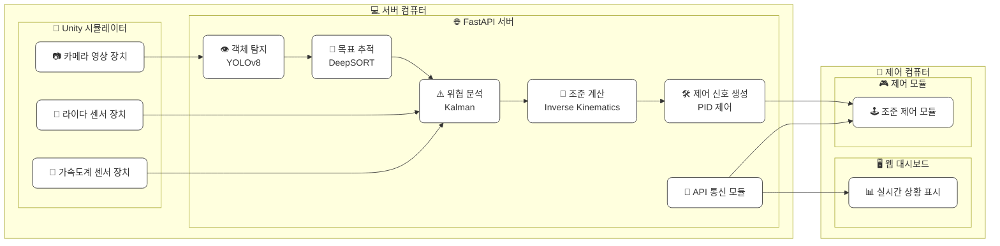

# **전차의 이미지 기반 표적 자동 조준 시스템**

## 전차 표적 자동 조준 프로젝트 진행 시 전차의 필요 동작/기능

### 시뮬레이터 선정

[전차 시뮬레이터 (이하 Tank Challenge)](https://bangbaedong-vallet-co-ltd.gitbook.io/tank-challenge)

### 전차의 기능

1. 전방/주변 객체 탐지
2. 위협도에 따른 우선순위 판단
3. 목표 자동조준 및 제어

### 알고리즘 참고 문헌

-

## 전차 자율주행 시스템 세부 정리표

### 프로젝트 목적 요약

| **항목**   | **내용**                                                          |
| ---------- | ----------------------------------------------------------------- |
| 시뮬레이터 | 제공된 시뮬레이션 엔진 (3D 전차, 유니티 엔진)                     |
| 주요 기능  | 주변 상황 파악, 위협 판단, 자동 조준                              |
| 사용 기술  | 영상 인식 기술, 행동 분석 기술, 자동 제어 기술, 예측 및 보정 기술 |
| 개발 목표  | 안정성 향상, 정확한 목표 조준, 실시간 반응, 데이터 처리 최적화    |

### 사용 알고리즘

| **목적**            | **사용 알고리즘**  | **이유**                                |
| ------------------- | ------------------ | --------------------------------------- | --- |
| 오브젝트 탐지       | YOLOv8             | 격자 기반 빠른 탐지, 실시간 처리에 용이 |     |
| 목표 추적           | DeepSORT           | 카메라와 목표 연결                      |
| 자동 조준 각도 계산 | Inverse Kinematics | 위치 정보 기반으로 포신 각도 계산       |
| 예측 보정           | Kalman Filter      | 상대 움직임 예측                        |
| 포신제어 안정화     | PID 제어           | 오차 보정                               |

### 전체 아키텍처

### 기능별 상세 구성

| **기능**  | **입력**             | **출력**             | **처리 기술**      |
| --------- | -------------------- | -------------------- | ------------------ |
| 객체 탐지 | 오브젝트             | 장애물, 아군, 적군   | YOLOv8             |
| 목표 추적 | 적 전차              | 적 전차 트레킹       | DeepSORT           |
| 위협 분석 | 관측값 (이전 예측값) | 현재 상태 추정값값   | DeepSORT           |
| 조준 계산 | 포격 위치, 타겟 위치 | 포탑 각도, 포신 각도 | Inverse Kinematics |
