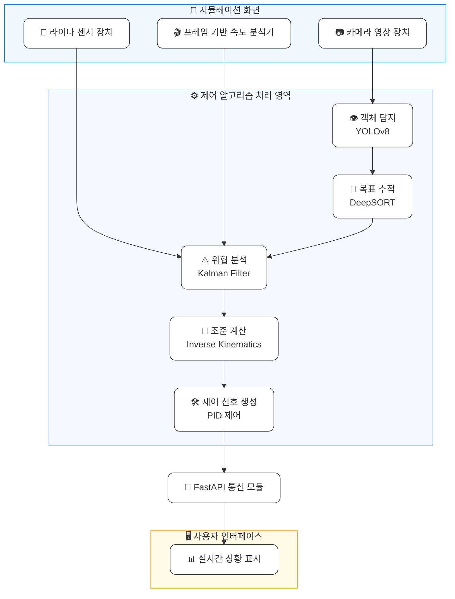

# **전차의 이미지 기반 표적 자동 조준 시스템**

## 전차 표적 자동 조준 프로젝트 진행 시 전차의 필요 동작/기능

### 시뮬레이터 선정

[전차 시뮬레이터 (Tank Challenge)](https://bangbaedong-vallet-co-ltd.gitbook.io/tank-challenge)

### 전차의 기능

1. 전방/주변 객체 탐지
2. 위협도에 따른 우선순위 판단
3. 목표 자동조준 및 제어

### 알고리즘 참고 문헌

-

## 전차 자율주행 시스템 세부 정리표

### 프로젝트 목적 요약

| **항목**   | **내용**                                                          |
| ---------- | ----------------------------------------------------------------- |
| 시뮬레이터 | 제공된 시뮬레이션 엔진 (3D 전차, 유니티 엔진)                     |
| 주요 기능  | 주변 상황 파악, 위협 판단, 자동 조준                              |
| 사용 기술  | 영상 인식 기술, 행동 분석 기술, 자동 제어 기술, 예측 및 보정 기술 |
| 개발 목표  | 안정성 향상, 정확한 목표 조준, 실시간 반응, 데이터 처리 최적화    |

### 사용 알고리즘

| **목적**            | **사용 알고리즘**  | **이유**                                |
| ------------------- | ------------------ | --------------------------------------- |
| 오브젝트 탐지       | YOLOv8             | 격자 기반 빠른 탐지, 실시간 처리에 용이 |
| 목표 추적           | DeepSORT           | 카메라와 목표 연결                      |
| 자동 조준 각도 계산 | Inverse Kinematics | 위치 정보 기반으로 포신 각도 계산       |
| 예측 보정           | Kalman Filter      | 상대 움직임 예측                        |
| 포신제어 안정화     | PID 제어           | 오차 보정                               |

### 전체 아키텍처

### 기능별 상세 구성 (우선도 순으로 정렬) 

| **대분류**             | **기능명**         | **입력**                            | **출력**                          | **상세 설명**                                                   | **필수 데이터**                         | **적용 기술**         |
|------------------------|--------------------|-------------------------------------|-----------------------------------|------------------------------------------------------------------|------------------------------------------|------------------------|
| 전방/주변 객체 탐지    | 객체 탐지          | 실시간 영상 프레임                  | 탐지된 객체(아군/적군/장애물 등) | 영상 속 객체를 실시간으로 감지하여 위치 및 클래스 식별           | 전차 외부 카메라 영상                   | YOLOv8                |
| 목표 자동조준 및 제어 | 조준 각도 계산     | 전차 위치, 적 위치                 | 포탑 회전각, 포신 고각            | 목표에 맞춰 포탑/포신이 회전해야 할 각도를 계산                   | 타겟 위치 좌표, 전차 위치 정보          | Inverse Kinematics    |
|  | 제어 신호 생성     | 현재 각도, 목표 각도               | 회전 명령(PID 제어 신호)         | 오차를 보정하여 포탑과 포신이 부드럽게 정확히 조준되도록 제어 신호 생성 | 포탑/포신 위치 센서값, 각도 목표값     | PID Controller        |
|      | 목표 추적          | 탐지된 적 전차의 위치              | 추적된 위치 정보(연속 ID 포함)   | 적 전차가 프레임 내에서 어떻게 움직이는지 지속적으로 추적         | 연속된 탐지 결과 (Bbox, ID 등)         | DeepSORT              |
|   위협도에 따른 판단   | 위협 분석          | 관측값, 이전 예측값                | 추정된 현재 상태(위치/속도 등)   | 적 전차의 현재 위치와 방향, 속도를 예측하여 위협 우선순위 판단    | 위치/속도 변화값, 이전 상태 예측       | Kalman Filter         |

#### 시나리오 1
> 전장에서 서라운드 카메라 영상을 실시간 처리해 적 전차를 탐지하는 상황

| 기능명              | 수행 결과 |
|---------------------|------------|
| 객체 탐지 (YOLOv8)   | 실시간으로 전장 영상에서 객체(적)를 정확히 탐지 |
| 목표 추적 (DeepSORT) | 움직이는 객체를 개별 식별(ID로 구분)하여 지속적으로 추적 |
| **최종 결과**       | 전차 주변 상황을 실시간으로 시각화하고 추적하여 오인 사격 등 **오탐 방지에 효과적** → **상황 인식 정확도 향상** |

---

#### 시나리오 2
> 탐지된 객체 중 적 전차가 조준 행동(포신 방향 전환 등)을 보일 때 이를 파악해 경보를 발생시키는 상황

| 기능명                   | 수행 결과 |
|--------------------------|------------|
| 목표 추적 (DeepSORT)     | 특정 적 전차의 조준 방향 변화 추적 |
| 위협 분석 (Kalman Filter)| 포신 회전, 접근 궤적 등을 기반으로 위협도 판단 및 예측 |
| **최종 결과**            | 조준 의도 또는 공격 전 조짐을 사전에 감지해 **자동 경고 발생** → **선제 대응 가능성 및 생존성 향상** |

---

#### 시나리오 3
> 위협 대상의 3D 위치 정보를 받아 전차 포탑 및 포신이 자동으로 해당 타깃에 조준하는 상황

| 기능명                 | 수행 결과 |
|------------------------|------------|
| 조준 각도 계산 (IK)     | 타겟 좌표에 맞춰 포탑/포신 회전각 계산 |
| 제어 신호 생성 (PID)    | 부드럽고 정밀하게 조준 각도에 맞춰 기계 제어 |
| **최종 결과**           | 조준 명령 없이도 적에게 **빠르고 정확한 자동 조준 수행** → **반응 시간 단축 및 전투 효율 극대화** |

