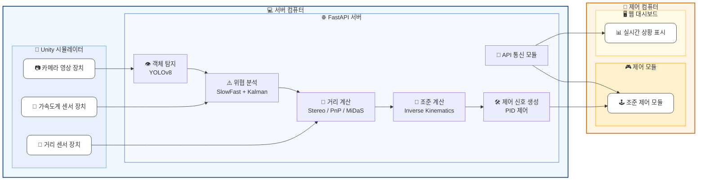

# **전차의 이미지 기반 표적 자동 조준 시스템**

## 전차 표적 자동 조준 프로젝트 진행 시 전차의 필요 동작/기능

### 시뮬레이터 선정

[전차 시뮬레이터 (이하 Tank Challenge)](https://bangbaedong-vallet-co-ltd.gitbook.io/tank-challenge)

### 전차의 기능

1. 전방/주변 객체 탐지
2. 위협 상황 분석 및 판단
3. 목표 자동조준 및 제어
4. 대상 거리 측정 및 보정

### 알고리즘 참고 문헌

-

## 전차 자율주행 시스템 세부 정리표

### 프로젝트 목적 요약

| **항목**   | **내용**                                                                             |
| ---------- | ------------------------------------------------------------------------------------ |
| 시뮬레이터 | 제공된 시뮬레이션 엔진 (3D 전차, 유니티 엔진진)                                      |
| 주요 기능  | 주변 상황 파악, 위협 판단, 자동 조준, 거리 측정정                                    |
| 사용 기술  | 영상 인식 기술, 행동 분석 기술, 3D 위치 측정 기술, 자동 제어 기술, 예측 및 보정 기술 |
| 개발 목표  | 안정성 향상, 정확한 목표 조준, 실시간 반응, 데이터 처리 최적화                       |

### 사용 알고리즘

| **목적**              | **사용 알고리즘**   | **이유**                                |
| --------------------- | ------------------- | --------------------------------------- |
| 오브젝트 탐지         | YOLOv8              | 격자 기반 빠른 탐지, 실시간 처리에 용이 |
| 움직임·조준 행동 파악 | SlowFast            | 시계열 분석, 조준 동작 구별             |
| 거리 계산             | PnP 알고리즘, MiDaS | 카메라와 실제 좌표 연결                 |
| 자동 조준 각도 계산   | Inverse Kinematics  | 위치 정보 기반으로 포신 각도 계산       |
| 예측 보정             | Kalman Filter       | 상대 움직임 예측                        |
| 포신제어 안정화       | PID 제어            | 오차 보정                               |

